# Java 21 Microservices Architecture - DEFIMON

## 🏗️ Architecture Overview

This document outlines a modern Java 21 microservices architecture for the DEFIMON DeFi platform, leveraging cutting-edge Java features and Spring Boot 3.x ecosystem.

## 🎯 Key Java 21 Features Utilized

### Core Language Features
- **Virtual Threads** - Lightweight concurrency for high-throughput services
- **Pattern Matching** - Enhanced switch expressions and type checking
- **Records** - Immutable data classes for DTOs and domain models
- **Sealed Classes** - Type-safe hierarchies for domain modeling
- **Text Blocks** - Multi-line strings for configurations and queries
- **Foreign Function & Memory API** - Native performance for crypto operations
- **Sequenced Collections** - Enhanced collection interfaces
- **String Templates** - Safe string interpolation

### Modern Java Ecosystem
- **Spring Boot 3.2+** - Native support for Java 21
- **Spring Cloud 2023.x** - Latest cloud-native features
- **GraalVM Native Image** - Ultra-fast startup and low memory footprint
- **Project Loom** - Virtual threads for massive concurrency
- **Project Panama** - Native crypto operations
- **JEP 444: Virtual Threads** - Platform threads for blocking I/O

## 🏛️ Microservices Architecture

```mermaid
graph TB
    %% Client Layer
    subgraph "Client Layer"
        WEB[Web Dashboard]
        API_CLIENTS[API Clients]
        MOBILE[Mobile Apps]
        EXTERNAL[External Integrations]
    end

    %% API Gateway Layer
    subgraph "API Gateway Layer"
        GW[API Gateway<br/>Java 21 + Spring Cloud Gateway<br/>Virtual Threads + Reactive]
        AUTH[Authentication Service<br/>Java 21 + Spring Security<br/>JWT + OAuth2]
        RATE_LIMIT[Rate Limiting<br/>Redis + Resilience4j]
    end

    %% Core Business Services
    subgraph "Core Business Services"
        USER_SVC[User Management Service<br/>Java 21 + Spring Boot 3.2<br/>Virtual Threads + JPA]
        
        WALLET_SVC[Wallet Service<br/>Java 21 + Spring Boot 3.2<br/>Native Crypto Operations]
        
        TRADING_SVC[Trading Service<br/>Java 21 + Spring Boot 3.2<br/>Virtual Threads + WebSocket]
        
        PRICE_SVC[Price Aggregation Service<br/>Java 21 + Spring Boot 3.2<br/>Virtual Threads + Reactive]
        
        ANALYTICS_SVC[Analytics Service<br/>Java 21 + Spring Boot 3.2<br/>Virtual Threads + Batch Processing]
        
        NOTIFICATION_SVC[Notification Service<br/>Java 21 + Spring Boot 3.2<br/>Virtual Threads + Event Streaming]
    end

    %% Blockchain Services
    subgraph "Blockchain Services"
        ETH_SYNC[Ethereum Sync Service<br/>Rust + Java 21 Hybrid<br/>High Performance]
        
        BTC_SYNC[Bitcoin Sync Service<br/>Java 21 + Native RPC<br/>Virtual Threads]
        
        MULTICHAIN[Multi-Chain Service<br/>Java 21 + Spring Boot 3.2<br/>Plugin Architecture]
    end

    %% Data Services
    subgraph "Data Layer"
        AGGREGATION_SVC[Data Aggregation Service<br/>Java 21 + Spring Boot 3.2<br/>Virtual Threads + Reactive Streams]
        
        CACHE_SVC[Cache Service<br/>Redis + Hazelcast<br/>Distributed Caching]
        
        SEARCH_SVC[Search Service<br/>Elasticsearch + Java 21<br/>Full-Text Search]
    end

    %% Infrastructure Services
    subgraph "Infrastructure Services"
        CONFIG_SVC[Configuration Service<br/>Java 21 + Spring Cloud Config<br/>Centralized Config]
        
        DISCOVERY_SVC[Service Discovery<br/>Consul + Eureka<br/>Service Registry]
        
        MONITORING_SVC[Monitoring Service<br/>Micrometer + Prometheus<br/>Observability]
    end

    %% Message Broker
    subgraph "Message Broker"
        KAFKA[Apache Kafka<br/>Event Streaming Platform]
        KAFKA_STREAMS[Kafka Streams<br/>Java 21 + Stream Processing]
    end

    %% Data Storage
    subgraph "Data Storage"
        POSTGRES[(PostgreSQL<br/>Transactional Data<br/>ACID Compliance)]
        
        MONGODB[(MongoDB<br/>Document Store<br/>Blockchain Data)]
        
        TIMESERIES[(TimescaleDB<br/>Time Series<br/>Market Data)]
        
        REDIS[(Redis<br/>Cache + Sessions<br/>High Performance)]
    end

    %% External Integrations
    subgraph "External Integrations"
        EXCHANGES[Crypto Exchanges<br/>REST/WebSocket APIs]
        
        BLOCKCHAIN_NODES[Blockchain Nodes<br/>Ethereum, Bitcoin, etc.]
        
        PRICE_FEEDS[Price Feeds<br/>Chainlink, CoinGecko, etc.]
    end

    %% Connections
    WEB --> GW
    API_CLIENTS --> GW
    MOBILE --> GW
    EXTERNAL --> GW

    GW --> AUTH
    GW --> RATE_LIMIT
    GW --> USER_SVC
    GW --> WALLET_SVC
    GW --> TRADING_SVC
    GW --> PRICE_SVC
    GW --> ANALYTICS_SVC

    AUTH --> REDIS
    USER_SVC --> POSTGRES
    WALLET_SVC --> POSTGRES
    TRADING_SVC --> KAFKA
    PRICE_SVC --> TIMESERIES
    ANALYTICS_SVC --> POSTGRES
    NOTIFICATION_SVC --> KAFKA

    ETH_SYNC --> MONGODB
    BTC_SYNC --> MONGODB
    MULTICHAIN --> MONGODB

    AGGREGATION_SVC --> KAFKA
    AGGREGATION_SVC --> MONGODB
    CACHE_SVC --> REDIS
    SEARCH_SVC --> POSTGRES

    CONFIG_SVC --> POSTGRES
    DISCOVERY_SVC --> CONSUL
    MONITORING_SVC --> PROMETHEUS

    KAFKA --> KAFKA_STREAMS

    EXCHANGES --> PRICE_SVC
    BLOCKCHAIN_NODES --> ETH_SYNC
    BLOCKCHAIN_NODES --> BTC_SYNC
    PRICE_FEEDS --> PRICE_SVC

    %% Styling
    classDef javaService fill:#e1f5fe,stroke:#01579b,stroke-width:3px
    classDef rustService fill:#fff3e0,stroke:#e65100,stroke-width:2px
    classDef dataStore fill:#e8f5e8,stroke:#1b5e20,stroke-width:2px
    classDef external fill:#fce4ec,stroke:#880e4f,stroke-width:2px
    classDef infrastructure fill:#f3e5f5,stroke:#4a148c,stroke-width:2px

    class GW,AUTH,USER_SVC,WALLET_SVC,TRADING_SVC,PRICE_SVC,ANALYTICS_SVC,NOTIFICATION_SVC,BTC_SYNC,MULTICHAIN,AGGREGATION_SVC,CACHE_SVC,SEARCH_SVC,CONFIG_SVC,DISCOVERY_SVC,MONITORING_SVC,KAFKA_STREAMS javaService
    class ETH_SYNC rustService
    class POSTGRES,MONGODB,TIMESERIES,REDIS dataStore
    class EXCHANGES,BLOCKCHAIN_NODES,PRICE_FEEDS external
    class KAFKA,PROMETHEUS,CONSUL infrastructure
```



## 🔧 Service Specifications

### 1. API Gateway Service
**Technology Stack:**
- Java 21 + Spring Cloud Gateway 4.0+
- Virtual Threads for high concurrency
- Reactive programming with WebFlux
- GraalVM Native Image support

**Key Features:**
- Route aggregation and load balancing
- Circuit breaker with Resilience4j
- Rate limiting with Redis
- Request/Response transformation
- API versioning and documentation

**Java 21 Benefits:**
- Virtual threads handle 100K+ concurrent connections
- Pattern matching for route configuration
- Records for configuration DTOs
- Text blocks for OpenAPI specifications

### 2. User Management Service
**Technology Stack:**
- Java 21 + Spring Boot 3.2
- Spring Security 6.x with OAuth2
- Virtual Threads for database operations
- JPA with Hibernate 6.x

**Key Features:**
- User registration and authentication
- Role-based access control (RBAC)
- Profile management
- Session management with Redis
- Multi-factor authentication

**Java 21 Benefits:**
- Virtual threads for non-blocking database calls
- Sealed classes for user types
- Records for user DTOs
- Enhanced switch expressions for role validation

### 3. Wallet Service
**Technology Stack:**
- Java 21 + Spring Boot 3.2
- Foreign Function & Memory API for crypto operations
- Virtual Threads for transaction processing
- Native image compilation

**Key Features:**
- Multi-chain wallet support
- Private key management with HSM
- Transaction signing and broadcasting
- Balance tracking across chains
- Hardware wallet integration

**Java 21 Benefits:**
- Foreign Function API for native crypto libraries
- Virtual threads for concurrent transaction processing
- Pattern matching for transaction type handling
- Records for wallet and transaction models

### 4. Trading Service
**Technology Stack:**
- Java 21 + Spring Boot 3.2
- WebSocket with virtual threads
- Reactive streams for order matching
- Native image for low latency

**Key Features:**
- Real-time order book management
- Trade execution and settlement
- Risk management and position tracking
- Market data streaming
- Order lifecycle management

**Java 21 Benefits:**
- Virtual threads for WebSocket connections
- Reactive streams for high-throughput processing
- Pattern matching for order type validation
- Records for trade and order models

### 5. Price Aggregation Service
**Technology Stack:**
- Java 21 + Spring Boot 3.2
- Virtual Threads for data collection
- Reactive WebClient for external APIs
- TimescaleDB for time-series data

**Key Features:**
- Multi-source price aggregation
- Real-time price feeds
- Historical price data
- Price validation and outlier detection
- Market data normalization

**Java 21 Benefits:**
- Virtual threads for concurrent API calls
- Reactive streams for data processing
- Text blocks for SQL queries
- Records for price data models

### 6. Analytics Service
**Technology Stack:**
- Java 21 + Spring Boot 3.2
- Virtual Threads for batch processing
- Apache Kafka Streams for real-time analytics
- PostgreSQL with advanced analytics extensions

**Key Features:**
- Portfolio analytics and reporting
- Risk metrics calculation
- Performance attribution
- Market analysis and insights
- Custom dashboard creation

**Java 21 Benefits:**
- Virtual threads for parallel batch processing
- Pattern matching for analytics rule evaluation
- Records for analytics result models
- Enhanced collections for data manipulation

### 7. Blockchain Sync Services
#### Ethereum Sync Service (Rust + Java 21 Hybrid)
**Technology Stack:**
- **Core Sync Engine**: Rust for high-performance data processing
- **Business Logic**: Java 21 for complex business rules and integrations
- **Data Processing**: Rust for real-time block parsing and event extraction
- **API Layer**: Java 21 with Spring Boot for service integration

**Why Rust for Ethereum:**
- **2TB+ data volume** requires zero-copy parsing and efficient memory management
- **12-second block times** demand high-throughput concurrent processing
- **Complex smart contract data** benefits from Rust's type safety
- **Continuous processing** leverages Rust's async/await performance

**Why Java 21 for Business Logic:**
- **Rich ecosystem** for complex business rule implementation
- **Spring integration** with other microservices
- **Virtual threads** for I/O-bound integration tasks
- **Better developer productivity** for business logic changes

#### Bitcoin Sync Service (Java 21)
**Technology Stack:**
- Java 21 + Spring Boot 3.2 for complete implementation
- Virtual Threads for I/O-bound RPC calls
- Scheduled processing for 10-minute block intervals
- PostgreSQL for UTXO state management

**Why Java 21 for Bitcoin:**
- **Lower data volume** (~500GB) manageable by JVM
- **10-minute blocks** allow for batch processing with virtual threads
- **Simple UTXO model** doesn't require Rust's performance benefits
- **Rich ecosystem** for business logic and integrations
- **Spring scheduling** perfect for periodic sync operations

**Key Features:**
- Multi-chain synchronization with technology-appropriate implementation
- Smart contract event processing (Ethereum) vs UTXO tracking (Bitcoin)
- Transaction monitoring and validation
- Block validation and indexing
- Real-time event streaming for Ethereum, batch processing for Bitcoin

## 🚀 Performance Optimizations

### Virtual Threads Implementation
```java
// High-concurrency request handling
@RestController
public class TradingController {
    
    @PostMapping("/orders")
    public CompletableFuture<OrderResponse> createOrder(@RequestBody OrderRequest request) {
        return CompletableFuture.supplyAsync(() -> {
            // Virtual thread automatically assigned
            return orderService.processOrder(request);
        });
    }
}
```

### Native Image Compilation
```bash
# Build native executable for ultra-fast startup
mvn spring-boot:build-image -Pnative
```

### Pattern Matching Usage
```java
// Enhanced switch expressions for transaction processing
public TransactionResult processTransaction(Transaction tx) {
    return switch (tx.type()) {
        case DEPOSIT deposit -> processDeposit(deposit);
        case WITHDRAWAL withdrawal -> processWithdrawal(withdrawal);
        case SWAP swap -> processSwap(swap);
        case TRANSFER transfer -> processTransfer(transfer);
        default -> throw new IllegalArgumentException("Unknown transaction type");
    };
}
```

### Records for Data Models
```java
// Immutable data models with built-in methods
public record OrderRequest(
    String symbol,
    OrderType type,
    BigDecimal quantity,
    BigDecimal price,
    Duration timeInForce
) {
    public OrderRequest {
        Objects.requireNonNull(symbol);
        Objects.requireNonNull(type);
        if (quantity.compareTo(BigDecimal.ZERO) <= 0) {
            throw new IllegalArgumentException("Quantity must be positive");
        }
    }
}
```

## 📊 Monitoring and Observability

### Metrics Collection
- **Micrometer** with Prometheus for metrics
- **Virtual thread metrics** for concurrency monitoring
- **Native image metrics** for performance tracking
- **Custom business metrics** for domain-specific monitoring

### Distributed Tracing
- **Spring Cloud Sleuth** with Zipkin/Jaeger
- **Virtual thread context propagation**
- **End-to-end request tracing**
- **Performance bottleneck identification**

### Logging
- **Structured logging** with JSON format
- **Log correlation** across services
- **Virtual thread-aware logging**
- **Performance logging** for optimization

## 🔒 Security Considerations

### Authentication & Authorization
- **OAuth2 + JWT** for stateless authentication
- **RBAC** with fine-grained permissions
- **Multi-factor authentication** support
- **Hardware security module** integration

### Data Protection
- **Encryption at rest** for sensitive data
- **Encryption in transit** with TLS 1.3
- **Private key protection** with HSM
- **PII data anonymization**

### Compliance
- **GDPR compliance** for user data
- **SOX compliance** for financial data
- **Audit logging** for all operations
- **Data retention policies**

## 🚀 Deployment Strategy

### Container Orchestration
- **Kubernetes** for container orchestration
- **Helm charts** for deployment management
- **Horizontal Pod Autoscaling** based on virtual thread metrics
- **Service mesh** with Istio for traffic management

### CI/CD Pipeline
- **GitHub Actions** for continuous integration
- **GraalVM native compilation** in CI/CD
- **Automated testing** with virtual threads
- **Blue-green deployment** for zero downtime

### Infrastructure as Code
- **Terraform** for infrastructure provisioning
- **Ansible** for configuration management
- **Prometheus Operator** for monitoring setup
- **Cert-manager** for TLS certificate management

## 📈 Scalability Considerations

### Horizontal Scaling
- **Stateless services** for easy scaling
- **Database sharding** for data distribution
- **Cache partitioning** for Redis clusters
- **Message queue partitioning** for Kafka topics

### Vertical Scaling
- **Virtual threads** for efficient resource utilization
- **Native images** for reduced memory footprint
- **JVM tuning** for optimal performance
- **Resource monitoring** and auto-scaling

### Performance Testing
- **Load testing** with virtual thread scenarios
- **Stress testing** for capacity planning
- **Chaos engineering** for resilience testing
- **Performance regression testing**

## 🔧 Development Tools

### IDE Support
- **IntelliJ IDEA 2023.3+** with Java 21 support
- **VS Code** with Java Extension Pack
- **GraalVM native image** debugging support
- **Virtual thread debugging** capabilities

### Build Tools
- **Maven 3.9+** with Java 21 support
- **Gradle 8.5+** with native image support
- **GraalVM native image** Maven plugin
- **Docker** multi-stage builds

### Testing Framework
- **JUnit 5.10+** with virtual thread support
- **Testcontainers** for integration testing
- **Mockito** for unit testing
- **WireMock** for API mocking

## 📋 Migration Strategy

### Phase 1: Foundation (Weeks 1-2)
1. Upgrade Java services to Java 21
2. Migrate to Spring Boot 3.2+
3. Update dependencies and configurations
4. Implement basic virtual thread support

### Phase 2: Optimization (Weeks 3-4)
1. Implement virtual threads in high-concurrency services
2. Add pattern matching and records
3. Optimize database connections with virtual threads
4. Implement native image compilation

### Phase 3: Advanced Features (Weeks 5-6)
1. Implement Foreign Function API for crypto operations
2. Add reactive streams and WebSocket support
3. Implement comprehensive monitoring
4. Performance testing and optimization

### Phase 4: Production Deployment (Weeks 7-8)
1. Deploy to staging environment
2. Load testing and performance validation
3. Security audit and compliance check
4. Production deployment with monitoring

## 🎯 Expected Benefits

### Performance Improvements
- **10x increase** in concurrent request handling with virtual threads
- **50% reduction** in memory usage with native images
- **3x faster** startup times with GraalVM
- **2x improvement** in throughput with reactive streams

### Developer Experience
- **Simplified concurrency** with virtual threads
- **Type safety** with pattern matching and sealed classes
- **Reduced boilerplate** with records
- **Better debugging** with enhanced tooling

### Operational Benefits
- **Lower infrastructure costs** with efficient resource utilization
- **Faster deployments** with native images
- **Better observability** with comprehensive monitoring
- **Improved reliability** with circuit breakers and retries

## 📚 References

- [Java 21 Release Notes](https://openjdk.org/projects/jdk/21/)
- [Spring Boot 3.2 Documentation](https://spring.io/projects/spring-boot)
- [GraalVM Native Image](https://www.graalvm.org/latest/reference-manual/native-image/)
- [Project Loom: Virtual Threads](https://openjdk.org/projects/loom/)
- [Spring Cloud Gateway](https://spring.io/projects/spring-cloud-gateway)
- [Micrometer Documentation](https://micrometer.io/docs)

---

*This architecture leverages the latest Java 21 features to create a high-performance, scalable, and maintainable DeFi platform that can handle millions of concurrent users while maintaining low latency and high reliability.*
