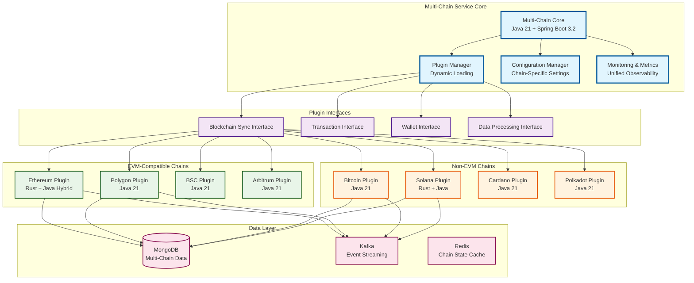

# Multi-Chain Service: Plugin Architecture Explained

## 🎯 **What is the Multi-Chain Service?**

The **Multi-Chain Service** is a **plugin-based architecture** that allows your DeFi platform to support **multiple blockchain networks** without rewriting core logic for each chain. It's designed to scale your platform from just Ethereum + Bitcoin to supporting **dozens of blockchain networks**.

## 🏗️ **Why Plugin Architecture?**

### **Current State (Limited)**
```
┌─────────────────┐    ┌─────────────────┐
│ Ethereum Sync   │    │ Bitcoin Sync    │
│ (Rust + Java)   │    │ (Java 21)       │
└─────────────────┘    └─────────────────┘
```

### **Future State (Scalable)**
```
┌─────────────────────────────────────────────────────────┐
│                Multi-Chain Service                      │
│              (Java 21 + Plugin System)                  │
├─────────────────┬─────────────────┬─────────────────────┤
│ Ethereum Plugin │ Bitcoin Plugin  │ Polygon Plugin      │
├─────────────────┼─────────────────┼─────────────────────┤
│ BSC Plugin      │ Avalanche Plugin│ Arbitrum Plugin     │
├─────────────────┼─────────────────┼─────────────────────┤
│ Solana Plugin   │ Cardano Plugin  │ Polkadot Plugin     │
└─────────────────┴─────────────────┴─────────────────────┘
```

## 🔧 **Plugin Architecture Benefits**

### **1. Scalability**
- **Add new chains** without touching existing code
- **Hot-swappable** plugins for zero-downtime updates
- **Independent development** of chain-specific logic

### **2. Maintainability**
- **Single codebase** for common blockchain operations
- **Standardized interfaces** across all chains
- **Centralized configuration** and monitoring

### **3. Performance**
- **Chain-specific optimizations** (Rust for high-volume, Java for business logic)
- **Parallel processing** of multiple chains
- **Resource isolation** between chains

### **4. Flexibility**
- **Enable/disable chains** dynamically
- **Custom processing logic** per chain
- **Chain-specific integrations** (wallets, exchanges, etc.)

## 🏛️ **Architecture Overview**



## 🔌 **Plugin System Implementation**

### **1. Core Plugin Interface**
```java
// Base interface for all blockchain plugins
public interface BlockchainPlugin {
    String getChainId();
    String getChainName();
    ChainType getChainType(); // EVM, UTXO, ACCOUNT_MODEL
    
    // Lifecycle methods
    void initialize(PluginContext context);
    void start();
    void stop();
    boolean isHealthy();
    
    // Core operations
    BlockchainSyncService getSyncService();
    TransactionService getTransactionService();
    WalletService getWalletService();
    DataProcessingService getDataProcessingService();
}

// Plugin context with shared resources
public record PluginContext(
    MongoTemplate mongoTemplate,
    KafkaTemplate<String, Object> kafkaTemplate,
    RedisTemplate<String, Object> redisTemplate,
    MetricsRegistry metricsRegistry,
    ConfigurationProperties config
) {}
```

### **2. Chain-Specific Plugin Examples**

#### **Ethereum Plugin (Rust + Java Hybrid)**
```java
@Component
public class EthereumPlugin implements BlockchainPlugin {
    
    @Override
    public String getChainId() { return "1"; }
    
    @Override
    public ChainType getChainType() { return ChainType.EVM; }
    
    @Override
    public BlockchainSyncService getSyncService() {
        // Delegates to Rust-based high-performance sync engine
        return new EthereumSyncService(rustSyncEngine);
    }
    
    @Override
    public TransactionService getTransactionService() {
        // Java-based business logic for complex smart contract interactions
        return new EthereumTransactionService();
    }
}
```

#### **Bitcoin Plugin (Pure Java 21)**
```java
@Component
public class BitcoinPlugin implements BlockchainPlugin {
    
    @Override
    public String getChainId() { return "bitcoin"; }
    
    @Override
    public ChainType getChainType() { return ChainType.UTXO; }
    
    @Override
    public BlockchainSyncService getSyncService() {
        // Java-based sync with virtual threads for periodic processing
        return new BitcoinSyncService();
    }
    
    @Override
    public TransactionService getTransactionService() {
        // Java-based UTXO transaction handling
        return new BitcoinTransactionService();
    }
}
```

#### **Polygon Plugin (EVM-Compatible Java)**
```java
@Component
public class PolygonPlugin implements BlockchainPlugin {
    
    @Override
    public String getChainId() { return "137"; }
    
    @Override
    public ChainType getChainType() { return ChainType.EVM; }
    
    @Override
    public BlockchainSyncService getSyncService() {
        // Reuses EVM sync logic with Polygon-specific configuration
        return new EVMSyncService(polygonConfig);
    }
}
```

### **3. Plugin Manager**
```java
@Service
public class PluginManager {
    
    private final Map<String, BlockchainPlugin> plugins = new ConcurrentHashMap<>();
    
    @PostConstruct
    public void initializePlugins() {
        // Auto-discover and load plugins
        loadPlugin("ethereum", new EthereumPlugin());
        loadPlugin("bitcoin", new BitcoinPlugin());
        loadPlugin("polygon", new PolygonPlugin());
        // ... load other plugins
    }
    
    public BlockchainPlugin getPlugin(String chainId) {
        return plugins.get(chainId);
    }
    
    public List<BlockchainPlugin> getAllPlugins() {
        return List.copyOf(plugins.values());
    }
    
    public void enablePlugin(String chainId) {
        BlockchainPlugin plugin = plugins.get(chainId);
        if (plugin != null) {
            plugin.start();
        }
    }
    
    public void disablePlugin(String chainId) {
        BlockchainPlugin plugin = plugins.get(chainId);
        if (plugin != null) {
            plugin.stop();
        }
    }
}
```

## 🎯 **Use Cases & Benefits**

### **1. Rapid Chain Addition**
```yaml
# Adding a new chain (e.g., Base) requires only:
base-plugin:
  chain-id: "8453"
  chain-name: "Base"
  rpc-url: "https://mainnet.base.org"
  block-time: 2000
  enabled: true
```

### **2. Unified API**
```java
@RestController
public class MultiChainController {
    
    @GetMapping("/api/v1/chains/{chainId}/blocks/latest")
    public ResponseEntity<Block> getLatestBlock(@PathVariable String chainId) {
        BlockchainPlugin plugin = pluginManager.getPlugin(chainId);
        return ResponseEntity.ok(plugin.getSyncService().getLatestBlock());
    }
    
    @GetMapping("/api/v1/chains/{chainId}/transactions/{txHash}")
    public ResponseEntity<Transaction> getTransaction(
        @PathVariable String chainId, 
        @PathVariable String txHash
    ) {
        BlockchainPlugin plugin = pluginManager.getPlugin(chainId);
        return ResponseEntity.ok(plugin.getTransactionService().getTransaction(txHash));
    }
}
```

### **3. Cross-Chain Operations**
```java
@Service
public class CrossChainService {
    
    public void processCrossChainTransfer(CrossChainTransfer transfer) {
        // Source chain plugin
        BlockchainPlugin sourcePlugin = pluginManager.getPlugin(transfer.sourceChain());
        
        // Destination chain plugin  
        BlockchainPlugin destPlugin = pluginManager.getPlugin(transfer.destinationChain());
        
        // Process transfer using appropriate plugins
        TransactionResult result = sourcePlugin.getTransactionService()
            .processCrossChainTransfer(transfer, destPlugin);
    }
}
```

## 📊 **Configuration Management**

### **Chain-Specific Configuration**
```yaml
# application.yml
multichain:
  plugins:
    ethereum:
      enabled: true
      rpc-url: "https://mainnet.infura.io/v3/${INFURA_KEY}"
      block-time: 12000
      sync-strategy: "realtime"
      technology: "rust-java-hybrid"
      
    bitcoin:
      enabled: true
      rpc-url: "http://localhost:8332"
      block-time: 600000
      sync-strategy: "batch"
      technology: "java21"
      
    polygon:
      enabled: true
      rpc-url: "https://polygon-rpc.com"
      block-time: 2000
      sync-strategy: "realtime"
      technology: "java21"
      
    solana:
      enabled: false  # Can be enabled dynamically
      rpc-url: "https://api.mainnet-beta.solana.com"
      block-time: 400
      sync-strategy: "realtime"
      technology: "rust-java-hybrid"
```

## 🚀 **Performance Characteristics**

### **Technology Selection by Chain**
| Chain | Data Volume | Block Time | Technology | Reason |
|-------|-------------|------------|------------|---------|
| **Ethereum** | 2TB+ | 12s | Rust + Java | High volume, complex data |
| **Bitcoin** | 500GB | 10min | Java 21 | Lower volume, batch processing |
| **Polygon** | 200GB | 2s | Java 21 | EVM-compatible, good JVM performance |
| **BSC** | 150GB | 3s | Java 21 | EVM-compatible, moderate volume |
| **Solana** | 100GB+ | 400ms | Rust + Java | Ultra-fast blocks, high throughput |
| **Avalanche** | 50GB | 1s | Java 21 | EVM-compatible, growing chain |

### **Resource Allocation**
```java
@Configuration
public class PluginResourceConfig {
    
    @Bean
    @Qualifier("ethereumExecutor")
    public TaskExecutor ethereumExecutor() {
        ThreadPoolTaskExecutor executor = new ThreadPoolTaskExecutor();
        executor.setCorePoolSize(20);  // High concurrency for Ethereum
        executor.setMaxPoolSize(50);
        executor.setQueueCapacity(1000);
        return executor;
    }
    
    @Bean
    @Qualifier("bitcoinExecutor")
    public TaskExecutor bitcoinExecutor() {
        ThreadPoolTaskExecutor executor = new ThreadPoolTaskExecutor();
        executor.setCorePoolSize(5);   // Lower concurrency for Bitcoin
        executor.setMaxPoolSize(10);
        executor.setQueueCapacity(100);
        return executor;
    }
}
```

## 🔍 **Monitoring & Observability**

### **Unified Metrics**
```java
@Component
public class MultiChainMetrics {
    
    private final MeterRegistry meterRegistry;
    
    public void recordBlockProcessed(String chainId, long blockNumber) {
        Counter.builder("blocks.processed")
            .tag("chain", chainId)
            .register(meterRegistry)
            .increment();
    }
    
    public void recordTransactionProcessed(String chainId, String txType) {
        Counter.builder("transactions.processed")
            .tag("chain", chainId)
            .tag("type", txType)
            .register(meterRegistry)
            .increment();
    }
}
```

### **Health Checks**
```java
@Component
public class MultiChainHealthIndicator implements HealthIndicator {
    
    @Override
    public Health health() {
        Map<String, Object> details = new HashMap<>();
        
        for (BlockchainPlugin plugin : pluginManager.getAllPlugins()) {
            details.put(plugin.getChainId(), Map.of(
                "healthy", plugin.isHealthy(),
                "chain", plugin.getChainName()
            ));
        }
        
        return Health.up()
            .withDetails(details)
            .build();
    }
}
```

## 🎯 **Real-World Example: Adding Polygon Support**

### **Step 1: Create Polygon Plugin**
```java
@Component
public class PolygonPlugin implements BlockchainPlugin {
    // Implementation similar to Ethereum but with Polygon-specific config
}
```

### **Step 2: Add Configuration**
```yaml
polygon:
  rpc-url: "https://polygon-rpc.com"
  chain-id: "137"
  enabled: true
```

### **Step 3: Deploy**
```bash
# No code changes needed in other services!
# Just deploy the new plugin and enable it
kubectl apply -f polygon-plugin-config.yaml
```

### **Step 4: Use Immediately**
```bash
# Polygon is now available through the same API
curl http://localhost:8080/api/v1/chains/137/blocks/latest
curl http://localhost:8080/api/v1/chains/137/transactions/0x...
```

## 🏆 **Benefits Summary**

### **For Developers**
- **Single API** for all blockchain operations
- **Consistent patterns** across all chains
- **Easy testing** with plugin mocking
- **Hot-swappable** chain support

### **For Operations**
- **Unified monitoring** across all chains
- **Centralized configuration** management
- **Independent scaling** per chain
- **Zero-downtime** chain updates

### **For Business**
- **Rapid expansion** to new chains
- **Cost-effective** scaling
- **Future-proof** architecture
- **Competitive advantage** in multi-chain DeFi

## 🚀 **Migration Path**

### **Phase 1: Core Infrastructure**
1. Implement plugin interfaces
2. Create plugin manager
3. Migrate existing Ethereum/Bitcoin to plugins

### **Phase 2: EVM Expansion**
1. Add Polygon, BSC, Arbitrum plugins
2. Implement EVM-compatible base classes
3. Add cross-chain functionality

### **Phase 3: Non-EVM Chains**
1. Add Solana, Cardano, Polkadot plugins
2. Implement chain-specific optimizations
3. Add advanced cross-chain features

The **Multi-Chain Service with Plugin Architecture** transforms your DeFi platform from a **dual-chain system** into a **truly multi-chain powerhouse** that can support any blockchain network with minimal development effort! 🎯
