# Metrics System Architecture

## Mermaid Diagram

```mermaid
graph TB
    %% Services Layer
    subgraph "DeFi Microservices"
        BS[Blockchain Sync Service<br/>Port: 9090]
        TS[Transaction Signing Service<br/>Port: 8082]
        MC[Math Computing Service<br/>Port: 8083]
        DA[Data Aggregation Service<br/>Port: 8084]
        AG[API Gateway<br/>Port: 8081]
        SM[Simple Metrics Service<br/>Port: 8080]
        BM[Bitcoin Metrics Service<br/>Port: 8085]
    end

    %% Metrics Collection Layer
    subgraph "Metrics Collection"
        BS --> |/metrics| P[Prometheus<br/>Port: 9091]
        TS --> |/metrics| P
        MC --> |/metrics| P
        DA --> |/metrics| P
        AG --> |/actuator/prometheus| P
        SM --> |/metrics| P
        BM --> |/metrics| P
    end

    %% Visualization Layer
    P --> |Scrapes Metrics| G[Grafana<br/>Port: 3000]
    
    %% Grafana Dashboards
    subgraph "Grafana Dashboards"
        G --> BD[Blockchain Sync Dashboard]
        G --> ED[Ethereum Infrastructure Dashboard]
        G --> SD[System Metrics Dashboard]
        G --> RD[Rust Microservices Dashboard]
        G --> MD[Microservices Health Dashboard]
        G --> HD[Microservices Status Dashboard]
        G --> TD[Simple Rust Dashboard]
    end

    %% Metrics Categories
    subgraph "Blockchain Sync Metrics"
        BS_M1[blocks_processed_total]
        BS_M2[last_processed_block]
        BS_M3[processing_errors_total]
        BS_M4[rpc_requests_total]
        BS_M5[rpc_request_duration_seconds]
        BS_M6[database_operations_total]
        BS_M7[database_operation_duration_seconds]
    end

    subgraph "Transaction Signing Metrics"
        TS_M1[transactions_signed_total]
        TS_M2[signing_duration_seconds]
        TS_M3[signing_errors_total]
        TS_M4[wallets_created_total]
        TS_M5[wallets_imported_total]
        TS_M6[active_sessions]
        TS_M7[memory_usage_bytes]
    end

    subgraph "Math Computing Metrics"
        MC_M1[calculations_total]
        MC_M2[calculation_duration_seconds]
        MC_M3[calculation_errors_total]
        MC_M4[active_calculations]
        MC_M5[memory_usage_bytes]
        MC_M6[cpu_usage_percent]
    end

    subgraph "Data Aggregation Metrics"
        DA_M1[data_points_processed_total]
        DA_M2[aggregation_operations_total]
        DA_M3[aggregation_duration_seconds]
        DA_M4[database_queries_total]
        DA_M5[database_query_duration_seconds]
        DA_M6[kafka_messages_consumed_total]
        DA_M7[active_streams]
        DA_M8[memory_usage_bytes]
        DA_M9[cache_hit_ratio]
    end

    subgraph "System Metrics"
        SYS_M1[service_requests_total]
        SYS_M2[service_request_duration_seconds]
        SYS_M3[service_memory_usage_bytes]
        SYS_M4[service_active_connections]
    end

    %% Data Flow
    BS --> BS_M1
    BS --> BS_M2
    BS --> BS_M3
    BS --> BS_M4
    BS --> BS_M5
    BS --> BS_M6
    BS --> BS_M7

    TS --> TS_M1
    TS --> TS_M2
    TS --> TS_M3
    TS --> TS_M4
    TS --> TS_M5
    TS --> TS_M6
    TS --> TS_M7

    MC --> MC_M1
    MC --> MC_M2
    MC --> MC_M3
    MC --> MC_M4
    MC --> MC_M5
    MC --> MC_M6

    DA --> DA_M1
    DA --> DA_M2
    DA --> DA_M3
    DA --> DA_M4
    DA --> DA_M5
    DA --> DA_M6
    DA --> DA_M7
    DA --> DA_M8
    DA --> DA_M9

    SM --> SYS_M1
    SM --> SYS_M2
    SM --> SYS_M3
    SM --> SYS_M4

    %% External Dependencies
    subgraph "External Dependencies"
        ETH[Ethereum RPC<br/>Infura]
        BTC[Bitcoin RPC<br/>Local Node]
        KAFKA[Apache Kafka<br/>Message Broker]
        MONGO[MongoDB<br/>Database]
    end

    BS --> ETH
    BS --> KAFKA
    BS --> MONGO
    DA --> KAFKA
    DA --> MONGO
    TS --> KAFKA
    MC --> KAFKA
    BM --> BTC

    %% Configuration
    subgraph "Configuration"
        PC[prometheus.yml<br/>Scrape Config]
        GC[grafana/datasources<br/>Prometheus Config]
    end

    P --> PC
    G --> GC

    %% Styling
    classDef serviceClass fill:#e1f5fe,stroke:#01579b,stroke-width:2px
    classDef metricsClass fill:#f3e5f5,stroke:#4a148c,stroke-width:2px
    classDef infraClass fill:#e8f5e8,stroke:#1b5e20,stroke-width:2px
    classDef configClass fill:#fff3e0,stroke:#e65100,stroke-width:2px

    class BS,TS,MC,DA,AG,SM,BM serviceClass
    class BS_M1,BS_M2,BS_M3,BS_M4,BS_M5,BS_M6,BS_M7,TS_M1,TS_M2,TS_M3,TS_M4,TS_M5,TS_M6,TS_M7,MC_M1,MC_M2,MC_M3,MC_M4,MC_M5,MC_M6,DA_M1,DA_M2,DA_M3,DA_M4,DA_M5,DA_M6,DA_M7,DA_M8,DA_M9,SYS_M1,SYS_M2,SYS_M3,SYS_M4 metricsClass
    class P,G,ETH,BTC,KAFKA,MONGO infraClass
    class PC,GC configClass
```

## Metrics System Overview

### Core Components

1. **Microservices with Metrics**:
   - **Blockchain Sync Service** (Rust) - Port 9090
   - **Transaction Signing Service** (Rust) - Port 8082
   - **Math Computing Service** (Rust) - Port 8083
   - **Data Aggregation Service** (Rust) - Port 8084
   - **API Gateway** (Java/Spring Boot) - Port 8081
   - **Simple Metrics Service** (Rust) - Port 8080
   - **Bitcoin Metrics Service** (Java/Spring Boot) - Port 8085

2. **Metrics Collection**:
   - **Prometheus** - Port 9091 (scrapes all service metrics)
   - **Grafana** - Port 3000 (visualizes metrics)

3. **Grafana Dashboards**:
   - Blockchain Sync Dashboard
   - Ethereum Infrastructure Dashboard
   - System Metrics Dashboard
   - Rust Microservices Dashboard
   - Microservices Health Dashboard
   - Microservices Status Dashboard
   - Simple Rust Dashboard

### Key Metrics Categories

#### Blockchain Sync Service (7 metrics)
- Block processing metrics
- RPC request metrics
- Database operation metrics
- Error tracking

#### Transaction Signing Service (7 metrics)
- Transaction signing metrics
- Wallet management metrics
- Session tracking
- Error categorization

#### Math Computing Service (6 metrics)
- Calculation metrics by type
- Performance metrics
- Resource usage
- Error tracking

#### Data Aggregation Service (9 metrics)
- Data processing metrics
- Aggregation operations
- Database query metrics
- Kafka message metrics
- Cache performance

#### System Metrics (4 metrics)
- Request metrics
- Performance metrics
- Resource usage
- Connection tracking

### Data Flow
1. Services expose metrics via HTTP endpoints (`/metrics` or `/actuator/prometheus`)
2. Prometheus scrapes metrics from all services every 15 seconds
3. Grafana queries Prometheus for visualization
4. Multiple specialized dashboards provide different views of the system

### Configuration
- **Prometheus**: `prometheus.yml` defines scrape targets and intervals
- **Grafana**: Auto-provisioned datasources and dashboards
- **Services**: Metrics exposed via Prometheus Rust client library
